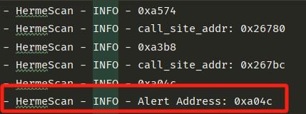

# HermeScan
# 0x1 Introduction
A lightweight, on-demand, context-sensitive taint analysis for binary in IoT firmware based on inter-procedural reaching definition analysis.

# 0x2 Installation
### Required Python Packages
- angr (tested on 9.2.26)
- networkx
- func_timeout
### Required Softwares
- IDA (tested on 7.5)
- Ghidra (tested on 10.2)
- strings or strings64.exe
# 0x3 Usage
### 1. Execute the SaTC
For identifying shared keywords and locating border binaries, execute the original [SaTC](https://github.com/NSSL-SJTU/SaTC) or the modified version 
provided in this repository without taint check parameter.

```commandline
python3 /SaTC/src/satc.py -d /firmware_extraction_path -o /outputs_path
```

The results are placed in /path_to_outputs/detail/Clustering_result_v2.result

### 2. Exexute the IDApython script
Copy the Hits Para and Hits API results into \*_origin_strs.txt where the * represents by the border binary name.
Note that the .txt should be placed in the same directory as the border binary file.


Configure the "strings" path in /HSEngine/src/config.py


Then execute the IDApython script
- For GUI 
  - Run IDA and import the border binary  
  - Analyze the binary with default settings 
  - Open "File -> Script file" and execute /HSEngine/src/Restruct_Enhanced_CFG.py
- For commandline
```commandline
    ida -c -A -S /HSEngine/src/Restruct_Enhanced_CFG.py border binary_path 
```

The results are stored in *.functions_info.txt.


### 3. Execute the HermeScan
```commandline
python3 HermeScanProject.py -b /path/to/binary -p False -t bof -d /path/to/Firmware -o /path/to/output -s /path/to/ida_functions_info.txt 
```

| Parameter |           Description           |            Value            |
|:---------:|:-------------------------------:|:---------------------------:|
|    [-b]   |      Binary to be analyzed      |       /path_to_binary       |
|    [-p]   | Reuse the existing Angr results |          True/False         |
|    [-t]   |   Vulnerability type to check   |          bof/ci/fmt         |
|    [-d]   |    Firmware extracting paths    |      /path_to_firmware      |
|    [-o]   |          Output results         |       /path_to_output       |
|    [-s]   |     External functions info     | /path_to_functions_info.txt |


The potenial vulnerable addresses are recorded as Alert Address::xxxxx in /path/to/output/*.log file



### 


